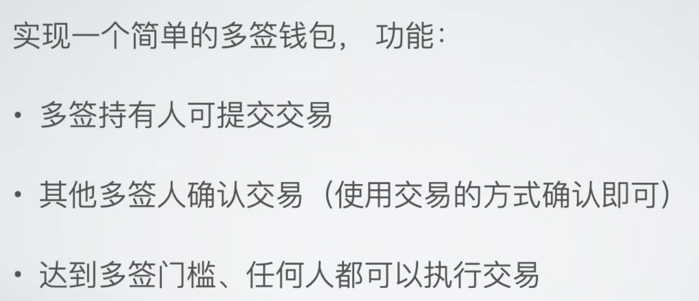

# 简易的多签钱包



## 合约代码

```solidity
// SPDX-License-Identifier: MIT
pragma solidity ^0.8.19;

import {Nonces} from "@openzeppelin/contracts/utils/Nonces.sol";
import {ReentrancyGuard} from "@openzeppelin/contracts//utils/ReentrancyGuard.sol";

contract MultiSigWallet is Nonces, ReentrancyGuard {
    address[] public owners;
    mapping(address account => bool membership) isOwner;
    uint256 public threshold;
    uint256 private balance;
    struct Transaction {
        address to;
        uint256 value;
        bytes data;
        uint256 NumOfConfirmations;
        bool executable;
    }
    mapping(uint256 txIndex => Transaction tx) transactions;
    mapping(uint256 txIndex => mapping(address owner => bool hasConfirmed)) isOwnerOfConfirmation;
    
    event TxCreated(address account, uint256 txIndex);
    event TxDiscarded(address account, uint256 txIndex);
    event ConfirmationAdded(address account, uint256 txIndex, uint256 currentNumOfConfirmations);
    event TxExecuted(address account, uint256 txIndex);
    event deposited(address sender, uint256 value);

    error NotOwner(address caller);
    error InvalidThreshold(uint256 inputThreshold);
    error ExecutionFailed(uint256 txIndex);
    error UnavailableTx(uint256 inputTxIndex);
    error InsufficientConfirmations(uint256 txIndex, uint256 currentAmount, uint256 requiredAmount);
    error Reconfirmation(uint256 txIndex, address account);
    error sendDataToEOA(address targetAddr);

    constructor(address[] memory _owners, uint256 _threshold) {
        owners = _owners;
        if (_threshold >= 1) {
            revert InvalidThreshold(_threshold);
        }
        threshold = _threshold;
    }

    modifier onlyOwner {
        if (!isOwner[msg.sender]) {
            revert NotOwner(msg.sender);
        }
        _;
    }

    receive() external payable {
        deposite();
    }

    /**
     * @notice Owner creates a new transaction.
     * 
     * @param _to the target address of the transaction created
     * @param _value the amount of the native token sent to `_to`
     * @param _callData the ABI encoded data sent to `_to`.
     */
    function createTransaction(address _to, uint256 _value, bytes memory _callData) public onlyOwner {
        if (!_isContract(_to) && _callData.length > 0) {
            revert sendDataToEOA(_to);
        }
        Transaction memory tx = Transaction({
            to: _to,
            value: _value,
            data: _callData,
            NumOfConfirmations: 1,
            executable: true
        });
        uint256 _txIndex = _useNonce(address(this));
        transactions[_txIndex] = tx;
        isOwnerOfConfirmation[_txIndex][msg.sender] = true;
        emit TxCreated(msg.sender, _txIndex);
    }

    function confirmTransaction(uint256 _txIndex) public onlyOwner nonReentrant {
        checkAvailabilityOfTx(_txIndex);
        if (isOwnerOfConfirmation[_txIndex][msg.sender]) {
            revert Reconfirmation(_txIndex, msg.sender);
        }
        transactions[_txIndex].NumOfConfirmations++;
        isOwnerOfConfirmation[_txIndex][msg.sender] = true;
        uint256 currentNumOfConfirmations = getNumOfConfirmations(_txIndex);
        emit ConfirmationAdded(msg.sender, _txIndex, currentNumOfConfirmations);
    }

    function executeTransaction(uint256 _txIndex) public onlyOwner nonReentrant returns (bytes memory) {
        checkAvailabilityOfTx(_txIndex);
        uint256 currentNumOfConfirmations = getNumOfConfirmations(_txIndex);
        if (currentNumOfConfirmations < threshold) {
            revert InsufficientConfirmations(_txIndex, currentNumOfConfirmations, threshold);
        }
        address target = transactions[_txIndex].to;
        uint256 valueSent = transactions[_txIndex].value;
        bytes memory callData = transactions[_txIndex].data;
        (bool success, bytes memory returnedData) = target.call{value: valueSent}(callData);
        if (!success) {
            revert ExecutionFailed(_txIndex);
        }
        delete transactions[_txIndex];
        emit TxExecuted(msg.sender, _txIndex);
        return returnedData;
    }

    function discardTransaction(uint256 _txIndex) public onlyOwner {
        checkAvailabilityOfTx(_txIndex);
        delete transactions[_txIndex];
        emit TxDiscarded(msg.sender, _txIndex);
    }
    
    function deposite() public payable {
        balance += msg.value;
        emit deposited(msg.sender, msg.value);
    }

    function getNumOfConfirmations(uint256 _txIndex) public view returns (uint256) {
        checkAvailabilityOfTx(_txIndex);
        return transactions[_txIndex].NumOfConfirmations; 
    }

    function getOwners() public view returns (address[] memory) {
        return owners;
    }

    function getBalance() public onlyOwner view returns (uint256) {
        return balance;
    }

    function getPendingTransaction(uint256 _txIndex) public view returns (Transaction memory) {
        checkAvailabilityOfTx(_txIndex);
        return transactions[_txIndex];
    }

    function checkAvailabilityOfTx(uint256 _txIndex) public view {
        uint256 currentMaxTxIndex = nonces(address(this));
        bool isExecutable = transactions[_txIndex].executable;
        if (_txIndex > currentMaxTxIndex || !isExecutable) {
            revert UnavailableTx(_txIndex);
        }
    }

    function _isContract(address _account) internal view returns (bool) {
        return _account.code.length > 0;
    }

}
```

